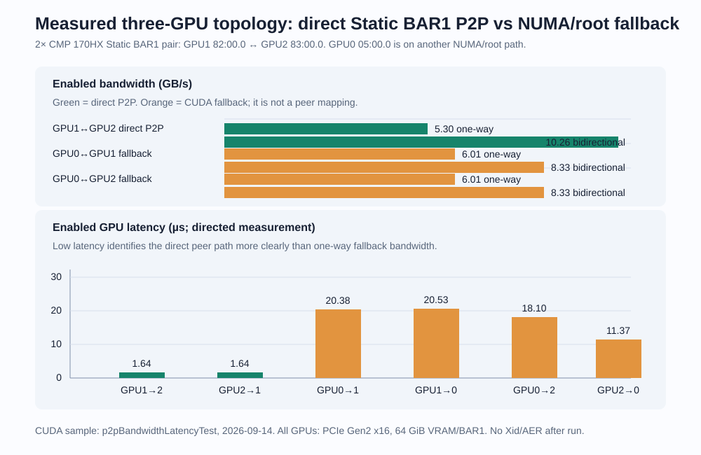
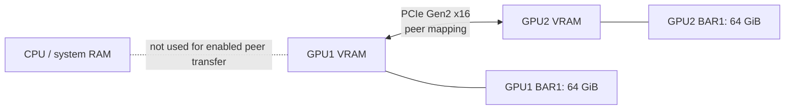

# Verified Static BAR1 CUDA P2P on CMP 170HX

[Русская версия](STATIC-BAR1-P2P.ru.md)

This is the current, content-verified P2P result for this project. It replaces
the earlier Mailbox B2 claim: that path could expose CUDA peer capability and
produce attractive benchmark numbers while failing to change peer VRAM.

## Result at a glance


| Metric | Before Static BAR1 | Static BAR1 P2P |
|---|---:|---:|
| `nvidia-smi topo -p2p r/w` | `GNS` | `OK` |
| One-way bandwidth | 5.77–5.88 GB/s, CUDA fallback | **5.30 GB/s, real P2P** |
| Bidirectional bandwidth | 8.07–8.23 GB/s, CUDA fallback | **10.27 GB/s, real P2P** |
| GPU-to-GPU latency | 15.7–18.9 µs | **1.69–1.71 µs** |
| Peer-copy data check | unavailable | **PASS in both directions** |
| SM peer read / write | unavailable | **PASS in both directions** |

The enabled P2P bandwidth is modestly lower than the fallback one-way number,
but it is a direct peer path rather than CPU/host-mediated fallback. The
bidirectional result and the latency show the practical improvement.

## Exact tested host

| Item | Value |
|---|---|
| GPUs tested | GPU1 `0000:82:00.0` ↔ GPU2 `0000:83:00.0` |
| GPU model / VRAM | 2× NVIDIA CMP 170HX, 64 GiB each |
| PCIe | Gen2, x16 per GPU (`LnkSta: Speed 5GT/s, Width x16`) |
| BAR1 | 64 GiB per GPU |
| Topology | NUMA node 1; `PHB` path, not a common PCIe switch |
| Kernel | `7.0.12-cmp170bar1test` |
| NVIDIA Open Kernel Modules | `610.57.04` |
| IOMMU | disabled: `intel_iommu=off iommu=off` |
| ACS | redirect disabled on the host-specific upstream ports |
| HBM / power | NDIV 70 / 1890 MHz; 300 W; persistence enabled |

GPU0 (`0000:05:00.0`) is on a different NUMA/root path and remained `TNS`.
It was deliberately not made CUDA-visible for these tests.

<a id="three-gpu-numa-root-complex"></a>
## Three-GPU NUMA and root-complex measurement

The initial two-GPU proof deliberately hid GPU0. On 2026-09-14 we repeated
the NVIDIA CUDA sample with all three cards visible. This turns the same host
into a useful topology comparison: GPU1↔GPU2 retains the verified Static BAR1
peer path, while GPU0 uses the normal CUDA fallback because it is behind a
different NUMA/root path.



| Visible CUDA pair | Topology / capability | One-way enabled result | Bidirectional enabled result | Enabled GPU latency |
|---|---|---:|---:|---:|
| GPU1 `82:00.0` ↔ GPU2 `83:00.0` | Same NUMA/root path; Static BAR1 P2P `OK` | **5.30 GB/s** each direction | **10.26 GB/s** | **1.64 µs** each direction |
| GPU0 `05:00.0` ↔ GPU1 `82:00.0` | Different NUMA/root path; `TNS`, CUDA fallback | 6.01 GB/s | 8.33 GB/s | 20.38 / 20.53 µs |
| GPU0 `05:00.0` ↔ GPU2 `83:00.0` | Different NUMA/root path; `TNS`, CUDA fallback | 6.01 GB/s | 8.33 GB/s | 18.10 / 11.37 µs |

All three CMP 170HX cards were still Gen2 x16 with 64 GiB VRAM and 64 GiB
BAR1; persistence mode was enabled. No new NVIDIA Xid or PCIe AER error was
reported after the run.

The 6.01 GB/s fallback number must **not** be mistaken for P2P. CUDA explicitly
reported that GPU0 could not access either peer, and the sample therefore used
its normal host-mediated copy procedure. The direct pair has a slightly lower
one-way figure, but wins where it matters: 10.26 versus 8.33 GB/s in both
directions and roughly 7–12× lower GPU latency. The earlier content check
proves that this pair really changes remote VRAM; the fallback pairs have no
such peer mapping.

This is also a practical warning for an added third or fourth CMP: a shared
NUMA node alone is not a guarantee. Every new directed pair must be checked
for its root-complex/ACS path, `nvidia-smi topo -p2p`, and a content test.

## What Static BAR1 changes



The driver creates a mapping to the remote GPU's BAR1 bus address and uses the
BAR1 P2P path rather than the normal mailbox/proprietary path. The relevant
driver changes are based on Bayley's patches:

**Source and reproducible build mode:** [Static BAR1 recovery source](../recovery/static-bar1/README.md)
contains the exact upstream links, preserved CMP source, build wrapper and
module configuration.

```text
0011-p2p-bar1.patch                 BAR1 mapping and peer-PTE path
0013-skip-mailbox-peer-preinit.patch  prevents mailbox pre-registration from blocking BAR1
0015-bar1p2p-readcap-override.patch   restores a denied read capability
```

For this build, `0012-mailbox-default.patch` was intentionally excluded because
it changes the BAR1 default back to the mailbox/default protocol.

The module configuration was:

```text
options nvidia NVreg_EnablePCIeGen3=1 NVreg_RegistryDwords="RMPcieLinkSpeed=0x5;RMForceStaticBar1=1;RMPcieP2PType=1"
```

`RMPcieLinkSpeed=0x5` and `NVreg_EnablePCIeGen3=1` are part of this host's
existing Gen2-unlock configuration; do not copy them as a generic recipe.

## Why this is evidence of real P2P

Capability reporting is not proof. The old Mailbox B2 route had `OK`-style
capability results and high sample numbers, but a content check later showed
that peer VRAM had not changed.

The test recorded here used CUDA Driver API contexts for exactly the two BDFs
above and validated all of the following:

1. `cuMemcpyPeer` copied a 4 MiB deterministic pattern from GPU1 to GPU2.
2. The reverse `cuMemcpyPeer` copied a different pattern from GPU2 to GPU1.
3. A kernel on each GPU directly read remote VRAM and returned the expected
   pattern locally.
4. A kernel on each GPU directly wrote a deterministic pattern into remote
   VRAM; a host readback from the remote GPU matched it.

All six checks passed. Only then was bandwidth measured with 20 × 128 MiB
peer copies. The CUDA sample independently reproduced the same 5.30 / 10.27
GB/s result.

## Raw artifacts

- [Correctness and bandwidth probe](../results/static-bar1-610.57.04-7.0.12-correctness.txt)
- [NVIDIA `p2pBandwidthLatencyTest` output](../results/static-bar1-610.57.04-7.0.12-p2pBandwidthLatencyTest.txt)
- [Fallback baseline without Static BAR1](../results/baseline-no-static-bar1-7.0.12.txt)
- [Three-GPU NUMA/root-complex `p2pBandwidthLatencyTest` output](../results/static-bar1-three-gpu-numa-20260914-p2pBandwidthLatencyTest.txt)

## Important limits

- `0015-bar1p2p-readcap-override.patch` forces a capability after NVIDIA's
  topology discovery rejects it. It is topology-sensitive.
- A shared NUMA node is not itself proof of P2P support. This host's tested
  pair is `PHB`, not a same-switch pair, and it passed the content test.
- Do not assume that a pair behind another root complex, another CPU socket,
  or an arbitrary PCIe switch will work. Test every directed pair with a
  content check, not only `nvidia-smi topo`.
- IOMMU-off and ACS redirect changes reduce DMA isolation. This is a bare-metal
  experimental configuration, not a virtualization-safe default.

## Reproduction checklist

1. Preserve a rollback copy of all five NVIDIA `.ko` modules, the initramfs,
   and module options.
2. Confirm 64 GiB BAR1 on **each** target GPU before loading a Static BAR1
   module.
3. Build the exact NVIDIA Open Kernel Module version for the running kernel.
4. Enable only the target pair with `CUDA_VISIBLE_DEVICES`, then run both a
   content check and `p2pBandwidthLatencyTest`.
5. Check `dmesg` for Xid/AER failures after the test.

The boot-time `Booter Load` status lines emitted by this unlock are expected
while its trusted SEC2 payload opens the required gates. No Xid or post-test
NVIDIA/AER fault was observed in this run.
