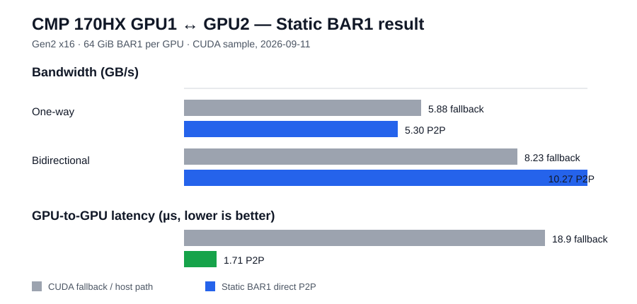
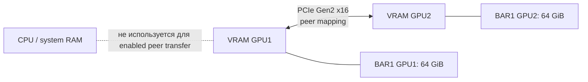

# Проверенный CUDA P2P Static BAR1 на CMP 170HX

[English version](STATIC-BAR1-P2P.md)

Это текущий результат проекта с проверкой **содержимого данных**. Он заменяет
старое утверждение о Mailbox B2: тот путь мог показывать CUDA peer capability
и красивые цифры benchmark, но позже выяснилось, что память соседней GPU не
изменялась.

## Результат кратко



| Показатель | До Static BAR1 | Static BAR1 P2P |
|---|---:|---:|
| `nvidia-smi topo -p2p r/w` | `GNS` | `OK` |
| Скорость в одну сторону | 5.77–5.88 GB/s, CUDA fallback | **5.30 GB/s, настоящий P2P** |
| Bidirectional | 8.07–8.23 GB/s, CUDA fallback | **10.27 GB/s, настоящий P2P** |
| Задержка GPU→GPU | 15.7–18.9 мкс | **1.69–1.71 мкс** |
| Проверка peer copy | недоступна | **PASS в обе стороны** |
| SM peer read / write | недоступны | **PASS в обе стороны** |

При включённом P2P скорость в одну сторону немного ниже fallback-цифры, но это
прямой peer path, а не путь через CPU/host. Bidirectional-скорость и latency
показывают практический выигрыш.

## Точно проверенный хост

| Параметр | Значение |
|---|---|
| Тестируемые GPU | GPU1 `0000:82:00.0` ↔ GPU2 `0000:83:00.0` |
| Модель / VRAM | 2× NVIDIA CMP 170HX, по 64 GiB |
| PCIe | Gen2, x16 на карту (`LnkSta: Speed 5GT/s, Width x16`) |
| BAR1 | 64 GiB на карту |
| Топология | NUMA node 1; путь `PHB`, не общий PCIe-switch |
| Ядро | `7.0.12-cmp170bar1test` |
| NVIDIA Open Kernel Modules | `610.57.04` |
| IOMMU | выключен: `intel_iommu=off iommu=off` |
| ACS | redirect выключен на upstream-port именно этого хоста |
| HBM / power | NDIV 70 / 1890 MHz; 300 W; persistence enabled |

GPU0 (`0000:05:00.0`) находится за другим NUMA/root path и остаётся `TNS`.
Она намеренно не была видна CUDA-тестам.

## Что меняет Static BAR1



Драйвер получает отображение удалённой VRAM через BAR1 bus address другой
карты и выбирает BAR1 P2P вместо обычного mailbox/proprietary path. Важные
патчи основаны на работе Bayley:

**Исходники и воспроизводимый режим сборки:** [Static BAR1 recovery source](../recovery/static-bar1/README.ru.md)
содержит точные upstream-ссылки, сохранённый CMP source, build wrapper и
конфигурацию модуля.

```text
0011-p2p-bar1.patch                   BAR1 mapping и peer-PTE path
0013-skip-mailbox-peer-preinit.patch  не даёт mailbox preinit заблокировать BAR1
0015-bar1p2p-readcap-override.patch   возвращает отклонённую read capability
```

`0012-mailbox-default.patch` в этой сборке намеренно исключён: он возвращает
выбор обратно к mailbox/default protocol.

Параметры модуля:

```text
options nvidia NVreg_EnablePCIeGen3=1 NVreg_RegistryDwords="RMPcieLinkSpeed=0x5;RMForceStaticBar1=1;RMPcieP2PType=1"
```

`RMPcieLinkSpeed=0x5` и `NVreg_EnablePCIeGen3=1` — часть уже работающей
Gen2-разлочки именно этого хоста; не копируйте их как универсальную схему.

## Почему это доказательство настоящего P2P

Capability — не доказательство. Старый Mailbox B2 уже умел показывать
положительные capability-результаты и высокие sample-цифры, но контроль данных
позже показал, что VRAM соседа не изменялась.

Здесь CUDA Driver API тестировал строго две указанные BDF и проверил:

1. `cuMemcpyPeer` с 4 MiB детерминированным шаблоном GPU1 → GPU2.
2. Обратный `cuMemcpyPeer` с другим шаблоном GPU2 → GPU1.
3. Ядро на каждой GPU напрямую читало удалённую VRAM и возвращало шаблон в
   локальную память.
4. Ядро на каждой GPU напрямую записывало шаблон в удалённую VRAM; readback с
   удалённой карты его подтвердил.

Все шесть проверок прошли. Только после этого измерялась скорость: 20 × 128
MiB peer copy. NVIDIA CUDA sample независимо повторил 5.30 / 10.27 GB/s.

## Сырые результаты

- [Проверка содержимого и bandwidth](../results/static-bar1-610.57.04-7.0.12-correctness.txt)
- [Полный вывод NVIDIA `p2pBandwidthLatencyTest`](../results/static-bar1-610.57.04-7.0.12-p2pBandwidthLatencyTest.txt)
- [Baseline без Static BAR1](../results/baseline-no-static-bar1-7.0.12.txt)

## Важные ограничения

- `0015-bar1p2p-readcap-override.patch` форсирует capability после отказа
  NVIDIA topology discovery. Он зависит от топологии.
- Общий NUMA node сам по себе не доказывает P2P. У этой пары путь `PHB`, а не
  same-switch, и именно поэтому была обязательна проверка содержимого.
- Не переносите результат автоматически на другую root complex, другой CPU
  socket или произвольный PCIe switch. Тестируйте каждую пару в обоих
  направлениях, а не только `nvidia-smi topo`.
- IOMMU-off и изменение ACS ухудшают DMA isolation. Это экспериментальная
  bare-metal конфигурация, а не безопасный режим для виртуализации.

## Минимальный порядок воспроизведения

1. Сохранить все пять NVIDIA `.ko`, initramfs и module options для отката.
2. Убедиться в BAR1 64 GiB у **каждой** целевой GPU до загрузки Static BAR1.
3. Собрать точную версию NVIDIA Open Kernel Module под текущее ядро.
4. Ограничить CUDA только целевой парой через `CUDA_VISIBLE_DEVICES`, затем
   выполнить content-check и `p2pBandwidthLatencyTest`.
5. После теста проверить `dmesg` на Xid/AER.

Строки `Booter Load` при запуске — ожидаемая часть SEC2-разлочки, открывающей
нужные привилегии. В этом прогоне после тестов не было Xid или NVIDIA/AER
ошибок.
